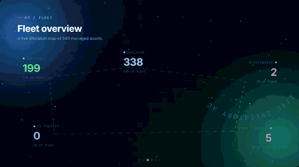

### HYLE Product Showcase

A looping, animated preview of HYLE — IT Asset & Operations Platform

Live: https://deadwayz.github.io/hyle-showcase/

HYLE was built to solve a common IT operations problem: scattered asset information, manual tracking, and limited visibility into equipment availability.

The platform provides a centralized view of IT assets, allowing teams to track inventory, manage assignments, prepare equipment for new hires, access device information through mobile QR scanning, and generate professional operational reports.

## What it does

* Real-time asset visibility and inventory tracking
* Standalone executive asset status overview for quickly understanding organization-wide availability and identifying assets requiring attention
* Equipment readiness planning for new starters
* Asset assignment and lifecycle management
* Mobile QR code scanning for instant device identification and asset details
* Executive-ready report generation and export for asset tracking, assignments, and operational insights
* AI-powered natural language asset search

## Built with

* Cloudflare Workers
* Cloudflare D1 Database
* JavaScript
* AI-powered workflows
* Automated reporting and document generation
* Mobile-friendly asset management capabilities

## Standalone Status Overview

HYLE also includes a dedicated standalone status experience designed for executives and non-technical staff.

The Status Overview provides a simplified, organization-wide view of the current IT asset fleet, focusing on availability, deployment, maintenance, and assets requiring attention. It is designed to communicate operational status at a glance without requiring users to navigate the full asset management platform.

The standalone view includes:

* Live total asset overview
* Available vs. deployed equipment visibility
* Maintenance and poor/failed asset indicators
* Searchable and sortable equipment availability
* Automatic data refresh
* Executive-focused presentation with minimal technical terminology

