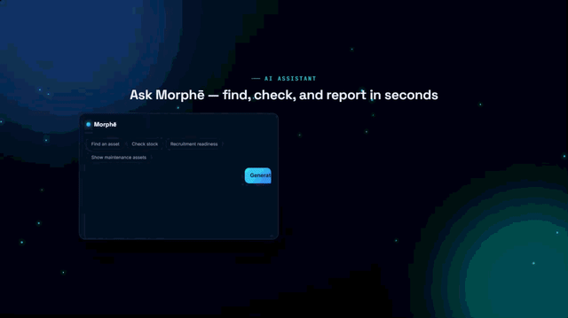

### HYLE Product Showcase

A looping, animated preview of HYLE — IT Asset & Operations Platform, built as a single self-contained HTML/CSS/JS page (no build step, no dependencies besides Google Fonts).

Live: https://deadwayz.github.io/hyle-showcase/

HYLE was built to solve a common IT operations problem: scattered asset information, manual tracking, and limited visibility into equipment availability.

The platform provides a centralized view of IT assets, allowing teams to track inventory, manage assignments, prepare equipment for new hires, access device information through mobile QR scanning, and generate professional operational reports.

## What it does
  - Real-time asset visibility and inventory tracking
  - Equipment readiness planning for new starters
  - Asset assignment and lifecycle management
  - Mobile QR code scanning for instant device identification and asset details
  - Executive-ready report generation and export for asset tracking, assignments, and operational insights
  - AI-powered natural language asset search

## Built with

  - Cloudflare Workers
  - Cloudflare D1 Database
  - JavaScript
  - AI-powered workflows
  - Automated reporting and document generation
  - Mobile-friendly asset management capabilities

