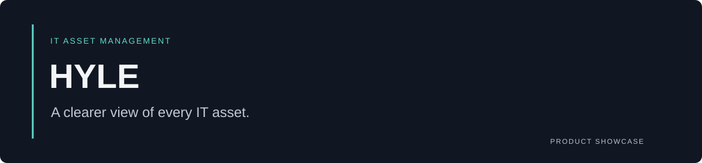
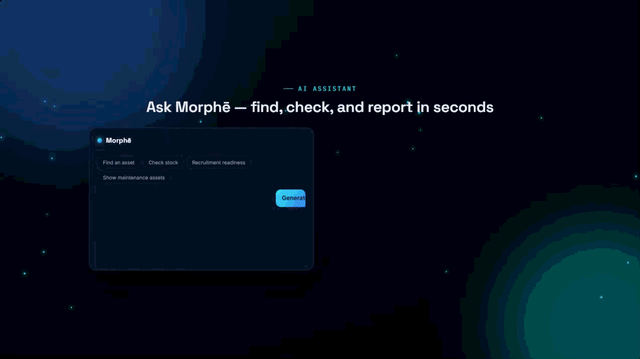
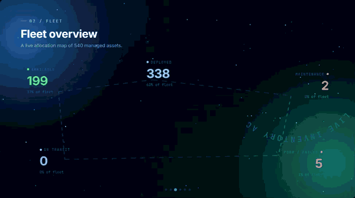

# HYLE

**A clearer view of every IT asset.**

HYLE brings inventory, equipment assignments, lifecycle planning, and reporting into one internal workspace. It helps an IT team answer practical questions: what is available, who has it, what needs attention, and what is needed next?

[Watch the product tour](https://deadwayz.github.io/hyle-showcase/) · [Explore the preview](#preview) · [Engineering notes](#engineering-notes)

## Why it exists

Asset information becomes harder to trust when inventory, assignment history, employee exits, and procurement planning live in separate records. HYLE connects those workflows so day-to-day decisions can start from the same operational picture.

## Preview

The public tour uses illustrative records and represents an earlier interface revision. It is a presentation of the product, not a connection to an organization's live inventory. The application source and operational environment remain private.

<strong>View the standalone asset-status presentation</strong>

The separate status experience emphasizes equipment availability and exceptions for readers who do not need the full management interface.

## What the application does

| Workflow | Purpose |
| --- | --- |
| Inventory and assignments | Track devices, ownership, location, condition, and lifecycle status |
| Equipment readiness | Compare upcoming needs with available equipment |
| Employee exits | Record returned equipment and final verification |
| Operational reporting | Produce inventory, assignment, and planning reports, including Excel export |
| Asset identification | Use QR-based identification and a separate device-status view |
| Staff administration | Manage accounts and administrative roles with attributable activity |
| Recovery snapshots | Retain manual and automatic snapshots for operational recovery |

## Engineering notes

- **One application boundary.** A Cloudflare Worker serves the browser interface and API, with Cloudflare D1 holding structured records.
- **Simple frontend, focused backend.** HTML, CSS, and JavaScript deliver the interface; server-side APIs handle persistence, authentication, and exports.
- **A distinct status view.** The operational workspace and simplified asset overview serve different information needs.
- **Search that matches the domain.** Natural-language-style asset queries and supported report commands are handled by application logic. They are not presented here as a general-purpose generative AI service.

**Application stack:** JavaScript · HTML/CSS · Cloudflare Workers · Cloudflare D1 · SheetJS

**Showcase stack:** Static HTML/CSS/JavaScript · animated GIFs · GitHub Pages

## Project scope

HYLE is an internal operations application. This repository contains its public product presentation, not an installable release or production database. The tour's sample totals are illustrative, not published organizational metrics.

## More projects

[Duer — responsibilities and recurring work](https://github.com/deadwayz/duer-showcase) · [LYNX — network monitoring](https://github.com/deadwayz/lynx-monitoring-showcase) · [Creator's GitHub profile](https://github.com/deadwayz)

## Usage and permissions

See [NOTICE.md](NOTICE.md) for showcase usage and third-party rights. Public visibility does not grant an open-source license for the application.
